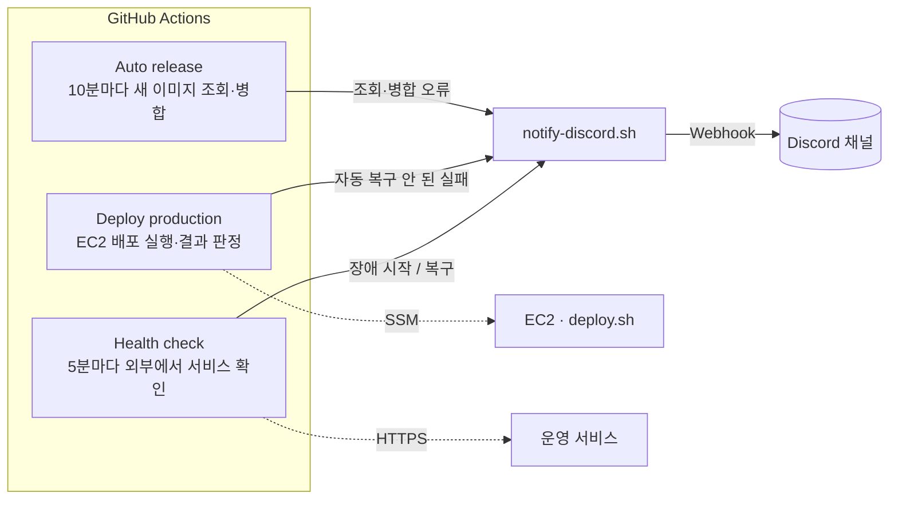

# 장애 알림 시스템

## 개요

KeepGo V1은 EC2 한 대에서 Docker Compose로 네 개의 컨테이너(web=Nginx, frontend=Next.js, backend=Spring Boot, ai-api=FastAPI)를 운영한다. 배포는 GitHub Actions가 자동으로 실행하고, 실패하면 배포 스크립트가 직전 버전으로 자동 롤백한다.

알림 시스템의 원칙은 하나다.

> **자동으로 해결되지 않은 문제만 사람에게 알린다.**

자동 롤백에 성공한 배포 실패나 Docker가 스스로 재시작해 회복한 컨테이너는 알리지 않는다. 이런 일은 GitHub Actions 실행 기록에만 남긴다. 배포·외부 감시 알림은 **Discord 채널**로 보낸다. CloudWatch + PG 확장에서는 인프라 알람은 SNS 이메일, 내부 서비스·수집 장애는 Grafana의 Discord 알림으로 보완한다. 설정과 적용 상태는 [모니터링 운영 구성](v1-monitoring.md)을 따른다.

## 구성



| 구성 요소 | 역할 |
| --- | --- |
| Auto release (10분 주기) | 앱 저장소의 새 이미지를 찾아 배포 목록(Manifest)을 갱신한다. 이 과정이 실패하면 알린다 |
| Deploy production | SSM으로 EC2의 배포 스크립트를 실행하고 종료 코드로 결과를 판정한다. 자동 복구되지 않은 실패만 알린다 |
| Health check (5분 주기) | 배포와 관계없이 외부에서 서비스 주소를 확인한다. 장애가 시작될 때와 복구될 때 한 번씩 알린다 |
| notify-discord.sh | 제목, 내용, 해당 GitHub Actions 실행 링크를 Discord Webhook으로 보낸다 |

이 절의 배포·외부 감시 알림은 GitHub runner에서 보낸다. 2026-09-30 추가한 CloudWatch·PG 구성에서는 Grafana도 EC2의 별도 비밀값으로 Discord Webhook을 사용한다. AWS 로그·지표·알람과 PG 호스트 자원 비용이 추가되므로 전체 모니터링을 무료 구성으로 보지 않는다.

## 1. 언제 알림이 가는가

| 상황 | 자동 처리 | Discord |
| --- | --- | --- |
| 배포 성공 | — | 보내지 않음 |
| 배포 실패 → 직전 버전으로 자동 복구 성공 | 롤백 + 실패 이미지 차단 | 보내지 않음 (Actions에 실패로 남음) |
| 배포 실패 → 자동 복구도 실패 | 없음 | 🚨 **운영 배포 실패** |
| 새 이미지 다운로드 실패, ECR 로그인 실패 | 운영은 그대로 유지 | 🚨 **운영 배포 실패** |
| 배포 설정 파일 오류, 배포 명령 전달(SSM) 실패·시간 초과 | 없음 | 🚨 **운영 배포 실패** |
| 새 이미지 조회·PR 병합·배포 호출 오류 | 없음 | 🚨 **자동 릴리스 실패** |
| 컨테이너가 죽음 | Docker가 자동 재시작 | 회복되면 보내지 않음 |
| 외부에서 약 2분 넘게 서비스 응답 이상 | 없음 | 🚨 **서비스 장애** (시작 시 1회) |
| 외부 응답 정상 회복 | — | ✅ **서비스 복구** (1회) |
| 배포 대상 미리 보기(dry_run) 실패 | — | 보내지 않음 (사람이 직접 실행해 결과를 보고 있음) |

## 2. 배포 실패 알림의 판정 기준

EC2의 배포 스크립트는 결과를 종료 코드로 알려 준다.

| 종료 코드 | 의미 | 알림 |
| --- | --- | --- |
| 0 | 성공 또는 바뀐 것 없음 | 없음 |
| 1 | 실패했지만 직전 버전으로 자동 복구됨 | 없음 |
| 2 | 사람이 확인해야 함(복구 실패, 다운로드 실패, 설정 오류, 현재 상태 비정상 등) | 🚨 운영 배포 실패 |

GitHub Actions는 SSM 결과가 "성공 + 코드 0"이면 성공, "실패 + 코드 1"이면 자동 복구로 본다. 그 밖의 모든 경우(코드 2, SSM 오류, 시간 초과, 배포 시작 전 AWS 인증 실패 등)는 사람이 확인해야 하는 실패로 보고 알린다.

## 3. 외부 감시 (Health check)

배포가 없는 시간에도 장애를 잡기 위해 5분마다 사용자와 같은 경로로 서비스에 접속해 본다.

| 확인 주소 | 거치는 경로 | 정상 기준 |
| --- | --- | --- |
| `https://도메인/healthz` | Nginx 자체 응답 | 200 |
| `https://도메인/` | Nginx → Frontend | 200~499 |
| `https://도메인/api` | Nginx → Backend | 200~499 |

- `/api`는 인증이 필요해 401·404가 올 수 있다. **응답 자체가 오면 Backend가 살아 있는 것으로 본다.** 502·503·504(Nginx가 Backend에 닿지 못함)나 연결 실패만 장애다.
- 세 주소가 모두 정상이면 바로 끝난다. 하나라도 이상하면 **30초 간격으로 최대 5번** 다시 확인한다(요청당 제한 시간 10초). 배포 중 Backend가 재기동하는 약 90초 동안 오탐하지 않기 위해서다.
- 5번 모두 이상하면 장애로 판정한다. 장애 판정까지 약 2분 이상 걸린다.

### 같은 장애를 반복해서 알리지 않는 방법

장애가 30분 이어지면 5분마다 검사가 돌아 같은 알림이 6번 온다. 이를 막으려고 **직전 Health check 실행 결과**와 비교해서 상태가 바뀔 때만 알린다.

| 이번 검사 | 직전 검사 | 동작 |
| --- | --- | --- |
| 장애 | 정상 | 🚨 서비스 장애 알림 |
| 장애 | 장애 | 알리지 않음 (이미 알림) |
| 정상 | 장애 | ✅ 서비스 복구 알림 |
| 정상 | 정상 | 알리지 않음 |

장애일 때는 Health check 실행 자체를 실패로 끝낸다. 그래서 GitHub Actions 목록에서도 장애 구간이 빨간색으로 보인다.

## 4. 알림 메시지

```text
[KeepGo] 🚨 서비스 장애 — 수동 확인 필요
https://도메인 응답 이상 (nginx=200 frontend=200 backend=502). 2분 넘게 자동 복구되지 않았다.
https://github.com/<저장소>/actions/runs/<실행 번호>
```

- 첫 줄은 알림 종류다.
- 둘째 줄은 원인 요약이다. 서비스 장애 알림이면 구간별 응답 코드가 들어간다(000은 연결 자체 실패).
- 셋째 줄은 해당 GitHub Actions 실행 링크다. 알림을 받으면 이 링크로 로그를 먼저 연다.

## 5. 알림을 받았을 때

| 알림 | 먼저 볼 것 | 조치 |
| --- | --- | --- |
| 🚨 운영 배포 실패 | 배포 로그 마지막의 `결과:` 값 | `pull_failed`: ECR에 이미지가 있는지 확인하고 앱 CI를 다시 실행한다. `rollback_failed`: EC2에서 컨테이너 상태와 로그를 보고 설정·Secret·RDS 원인을 고친다. SSM 시간 초과: EC2에서 배포가 아직 진행 중인지 먼저 확인한다. 해결 후 Deploy production을 수동으로 실행한다 |
| 🚨 자동 릴리스 실패 | 실패한 저장소와 단계 | GitHub API 일시 오류면 다음 조회에서 풀린다. PR 생성 권한 설정이나 브랜치 보호 규칙 문제면 설정을 고친다. **PR 병합 후 배포 호출만 실패했다면 다음 조회가 배포를 다시 부르지 않으므로** Deploy production을 수동으로 실행한다 |
| 🚨 서비스 장애 | 메시지의 구간별 응답 코드 | `backend=502`: Backend 컨테이너와 RDS 연결 확인. `frontend=502`: Frontend 컨테이너 확인. `nginx=000`: EC2 자체, 보안 그룹, 인증서 확인 |
| ✅ 서비스 복구 | 장애 시간대의 배포 이력과 로그 | 원인을 기록한다. 자동으로 회복됐더라도 같은 원인이 반복되지 않는지 확인한다 |

EC2에서 상태를 확인하는 명령:

```sh
cd /opt/keepgo/cloud
sudo docker compose -f compose.yaml ps                  # 컨테이너 상태
sudo docker compose -f compose.yaml logs --tail=100 backend
sudo tail -n 20 /opt/keepgo/state/history.log         # 최근 배포 결과
```

## 6. 설정 방법

| 설정 | 위치 | 값 |
| --- | --- | --- |
| `DISCORD_WEBHOOK_URL` | Cloud 저장소 → Settings → Secrets and variables → Actions → **Secrets** | Discord Webhook URL |
| `PUBLIC_ORIGIN` | 같은 곳 → **Variables** | 감시할 주소. 예: `https://도메인` (경로 없이) |

1. Discord에서 알림 받을 채널의 설정 → 연동 → 웹후크 → 새 웹후크를 만들고 URL을 복사한다. **URL이 곧 비밀번호이므로 코드나 채팅에 붙여넣지 않는다.**
2. 위 두 값을 GitHub에 등록한다.
3. GitHub Actions에서 **Health check → Run workflow**를 실행해 세 주소의 응답 코드가 정상으로 나오는지 확인한다.

- `PUBLIC_ORIGIN`이 비어 있으면 외부 감시가 실행되지 않는다.
- `DISCORD_WEBHOOK_URL`이 없으면 알림 대신 Actions 로그에 경고만 남는다.
- 외부 감시는 자동 배포 스위치(`AUTO_DEPLOY_ENABLED`)와 관계없이 계속 동작한다.

## 7. 시험 방법

실제 알림이 오는지는 정상 검사만으로 알 수 없다. 팀에 미리 알리고 합의한 점검 시간에 시험한다.

| 시험 | 기대 결과 |
| --- | --- |
| 정상 상태에서 Health check 수동 실행 | 성공, 알림 없음 |
| 컨테이너 하나를 `docker stop`으로 중지 | 약 2분 뒤 🚨 서비스 장애 알림, 실행 실패 |
| 중지한 상태로 다음 검사 | 추가 알림 없음 |
| 컨테이너 다시 시작 | ✅ 서비스 복구 알림, 실행 성공 |
| 존재하지 않는 이미지 SHA로 배포 | 운영은 그대로, 🚨 운영 배포 실패 알림 |
| dry_run 실행 중 오류 | 실행 실패, 알림 없음 |

`docker stop`으로 멈춘 컨테이너는 Docker가 자동 재시작하지 않는다. 그래서 "자동으로 회복되지 않는 장애"를 흉내 내기에 알맞다.

## 8. 한계와 감수한 이유

기존 GitHub Actions 알림은 추가 서버 없이 시작했다. 현재 CloudWatch·PG 확장과 함께 사용할 때의 한계 및 초기 판단을 아래에 구분한다.

### 1. 장애를 알아채기까지 몇 분이 걸린다

- **한계:** 검사는 5분마다 돌고, 장애로 판정하기까지 재시도로 약 2분이 더 걸린다. GitHub의 예약 실행은 부하에 따라 몇 분 늦게 시작되기도 한다. 최악의 경우 장애 발생 후 10분 가까이 지나서 알림이 온다.
- **감수한 이유:** GitHub가 무료로 제공하는 실행 환경을 쓰면 감시 서버를 따로 두거나 비용을 낼 필요가 없다. 서비스 초기 단계라 분 단위 감지로 충분하다고 판단했다. 재시도 2분은 배포 중 Backend 재기동(최대 약 90초)을 장애로 오인하지 않기 위한 값이라, 더 줄이면 배포 때마다 잘못된 알림이 온다.
- **필요해지면:** 외부 가동 감시 서비스나 AWS CloudWatch Synthetics로 1분 이하 주기의 감시를 추가한다.

### 2. 서버 자원·DB·내부 서비스 감시를 확장한다

- **구성:** CloudWatch가 EC2 상태·디스크·메모리, RDS 저장 공간·CPU, Agent 지표 누락을 감시한다. Prometheus·Grafana는 상세 호스트 지표와 BE·AI를 포함한 내부 health·수집 장애를 감시한다. 앱 로그는 CloudWatch Logs에 보관한다.
- **적용 상태:** 설정 파일을 준비했으며 실제 AWS 설치·수신 검증은 [구현 현황](v1-implementation-status.md)에 기록한다. 앱 요청률·오류율·p95는 BE·AI 계측 완료 후 추가한다. 현재 health 프로브는 실제 업무 기능의 정상 여부를 보장하지 않는다.
- **알림 경로:** CloudWatch는 SNS 이메일, Grafana는 Discord다. 기존 GitHub Actions의 외부 장애·배포 실패 알림은 유지한다. 같은 장애가 서로 다른 관측 경로에서 감지될 수 있다.
- **운영:** 비용·용량·최초 설치·로그 활성화·시험 절차는 [모니터링 운영 구성](v1-monitoring.md)을 따른다.

### 3. 알림 한 번이 누락될 수 있다

- **한계:** Discord 전송은 한 번만 시도하고 다시 보내지 않는다. 중복 알림을 막으려고 직전 실행이 실패였는지만 본다. 그래서 직전 실행이 장애가 아닌 이유(GitHub 일시 오류 등)로 실패했다면, 바로 이어진 실제 장애를 "이미 알린 장애"로 보고 넘어갈 수 있다. 이 경우 장애 알림 없이 복구 알림만 온다.
- **감수한 이유:** 알림 상태를 따로 저장하려면 DB나 캐시 같은 저장소가 필요하다. GitHub 실행 기록만으로 중복을 막으면 추가 인프라가 없다. 누락은 "직전 실행이 다른 이유로 실패"하고 "바로 다음에 실제 장애"가 겹칠 때만 생겨 드물고, 그 경우에도 GitHub Actions 목록에는 실패가 빨간색으로 남는다.
- **필요해지면:** 각 실행이 "장애로 판정했는지"를 결과물로 남기고, 실행 성공·실패 대신 그 값을 비교하도록 바꾼다.

### 4. 외부 HTTP 감시와 배포 알림은 GitHub Actions에 의존한다

- **한계:** GitHub Actions에 장애가 나면 Actions의 외부 HTTP 감시와 배포 알림도 멈춘다. 별도로 설치한 CloudWatch·Grafana 감시는 계속 동작한다. 공개 저장소의 예약 실행은 저장소 활동이 60일 동안 없으면 GitHub가 자동으로 끈다.
- **감수한 이유:** 배포도 이미 GitHub Actions에서 돌고 있어서, 감시를 같은 곳에 두면 관리할 곳이 하나로 줄어든다. 자동 배포 커밋이 저장소 활동으로 잡히므로 서비스가 개발되는 동안에는 60일 제한에 걸리지 않는다.
- **필요해지면:** 개발이 멈추는 시기에는 Actions 탭에서 비활성화 여부를 확인하거나, GitHub 밖의 외부 감시를 추가한다.
- **현재 상태:** 2026-09-30부터 이 조직에서 schedule이 동작하지 않아 Health check는 AWS EventBridge가 실행한다([TD-022](technical-decisions.md#td-022--github-schedule-대신-eventbridge로-주기-실행)). 모니터링 설치 뒤 Route 53 헬스 체크로 옮길 예정이며, 옮기면 외부 장애 알림이 SNS 이메일로 바뀌고 인증서 만료는 blackbox가 잡는다([TD-023](technical-decisions.md#td-023--외부-감시-유지-route-53-헬스-체크로-이전)).

### 5. 공개 저장소라는 무료 전제는 GitHub Actions 부분에만 적용된다

- **한계:** 공개 저장소는 GitHub 기본 실행 환경이 무제한 무료다. 저장소를 비공개로 바꾸면 사용량이 과금 대상이 된다. 실행 시간은 한 번에 1분 단위로 올림해 계산되므로, Health check(하루 288회)와 Auto release(하루 144회)만으로 월 약 13,000분이 된다. 비공개 무료 한도(플랜에 따라 월 2,000~3,000분)를 크게 넘는다.
- **감수한 이유:** Cloud 저장소는 이미 공개이고, 코드에 비밀값이 없다(비밀값은 GitHub Secrets와 EC2에만 있다). 공개를 유지하는 한 비용이 없다. 감시 요청은 5분에 3개라 EC2 부하도 무시할 수준이고, 전송량도 월 수십 MB라 AWS 무료 전송량 안이다.
- **필요해지면:** 비공개로 바꾸면 검사·조회 간격을 15~30분으로 늘리거나 외부 감시 서비스로 옮긴다.

### 6. 응답하지 않는 컨테이너는 스스로 회복되지 않는다

- **한계:** Docker 자동 재시작은 프로세스가 **종료된** 경우만 처리한다. 떠 있지만 응답하지 않는(unhealthy) 컨테이너는 그대로 남는다.
- **감수한 이유:** unhealthy 컨테이너까지 자동 재시작하려면 별도 감시 컨테이너(autoheal 등)를 추가해야 한다. 원인을 모른 채 재시작을 반복하면 DB 연결 문제 같은 실제 원인을 가리게 된다. 이 경우는 외부 감시가 알림으로 잡고, 사람이 원인을 확인한 뒤 조치하는 편이 안전하다고 판단했다.
- **필요해지면:** 같은 원인의 unhealthy가 반복되고 재시작으로 해결되는 것이 확인되면 자동 재시작 컨테이너를 추가한다.
