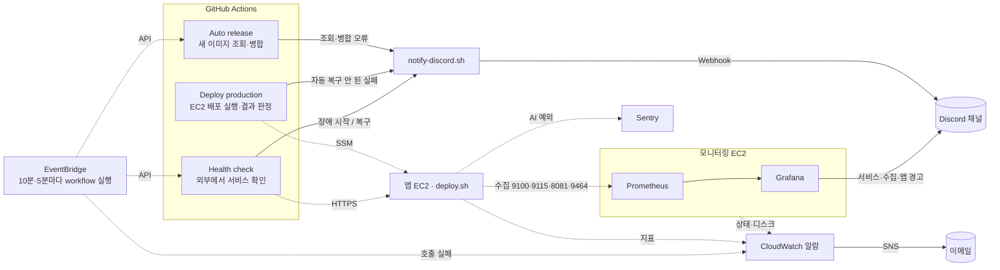

# 장애 알림 시스템

## 개요

KeepGo V1은 앱 EC2 한 대에서 Docker Compose로 네 개의 컨테이너(web=Nginx, frontend=Next.js, backend=Spring Boot, ai-api=FastAPI)를 운영한다. 배포는 GitHub Actions가 자동으로 실행하고, 실패하면 배포 스크립트가 직전 버전으로 자동 롤백한다. Prometheus·Grafana는 별도 모니터링 EC2에서 돌린다([TD-024](technical-decisions.md#td-024--모니터링-전용-인스턴스-분리)).

알림 시스템의 원칙은 하나다.

> **자동으로 해결되지 않은 문제만 사람에게 알린다.**

자동 롤백에 성공한 배포 실패나 Docker가 스스로 재시작해 회복한 컨테이너는 알리지 않고 GitHub Actions 실행 기록에만 남긴다. 다만 이 원칙 때문에 "새 버전이 조용히 안 나간" 경우도 묻힌다(8-7).

알림은 네 경로로 나뉜다.

| 경로 | 보내는 곳 | 채널 | 상태 |
| --- | --- | --- | --- |
| GitHub Actions (`notify-discord.sh`) | 배포·릴리스 실패, 외부 감시(Health check) | Discord | 운영 중 |
| Grafana (모니터링 EC2) | 내부 서비스 비정상, 수집 불가, 앱 경고 | Discord | 모니터링 EC2 운영 중, Discord 수신 시험 기록 없음 |
| CloudWatch 알람 → SNS | 앱·모니터링 EC2, RDS, 주기 실행 토큰 | 이메일 | 스택 존재, 알람·구독 승인 미확인. 앱 로그 전송은 2026-10-01 적용 |
| Sentry | AI 앱 예외, (예정) 외부 감시 | Sentry 알림 규칙 | 에러 수집 운영 중, Uptime 설정 전 |

설치·적용 상태는 [모니터링 운영 구성](v1-monitoring.md), Sentry는 [Sentry 사용 정리](v1-sentry.md)를 따른다.

## 구성



| 구성 요소 | 역할 |
| --- | --- |
| EventBridge | 이 레포에서 GitHub schedule이 실행되지 않아 Auto release(10분)·Health check(5분)를 대신 실행한다([TD-022](technical-decisions.md#td-022--github-schedule-대신-eventbridge로-주기-실행)) |
| Auto release | 앱 저장소의 새 이미지를 찾아 배포 목록(Manifest)을 갱신한다. 이 과정이 실패하면 알린다 |
| Deploy production | SSM으로 앱 EC2의 배포 스크립트를 실행하고 종료 코드로 결과를 판정한다. 자동 복구되지 않은 실패만 알린다 |
| Health check | 배포와 관계없이 밖에서 공개 주소를 확인한다. 장애가 시작될 때와 복구될 때 한 번씩 알린다. Sentry Uptime으로 이전 예정([TD-023](technical-decisions.md#td-023--외부-감시-유지-sentry-uptime으로-이전)) |
| notify-discord.sh | 제목, 내용, 해당 GitHub Actions 실행 링크를 Discord Webhook으로 보낸다 |
| Grafana | Prometheus 지표로 내부 서비스·수집·앱 경고를 판정해 같은 Discord 채널로 보낸다. 복구 알림을 보내고, 장애가 이어지면 4시간마다 다시 알린다 |
| CloudWatch 알람 | 서버 자원·RDS·호스트 상태와 EventBridge 호출 실패를 SNS 이메일로 보낸다 |

AWS 로그·지표·알람, 모니터링 EC2(t4g.small)는 과금 대상이다. 전체 알림 구성을 무료로 보지 않는다.

## 1. 언제 알림이 가는가

### 1-1. 배포·릴리스 (GitHub Actions → Discord)

| 상황 | 자동 처리 | 알림 |
| --- | --- | --- |
| 배포 성공 | — | 보내지 않음 |
| 배포 실패 → 직전 버전으로 자동 복구 성공 | 롤백 + 실패 이미지 차단 | **보내지 않음** (Actions에 실패로 남음, 8-7) |
| 차단된 이미지라 교체를 건너뜀 | 이전 버전 유지 | **보내지 않음.** 결과가 `unchanged`로만 남음 (8-7) |
| 배포 실패 → 자동 복구도 실패 | 없음 | 🚨 **운영 배포 실패** |
| 새 이미지 다운로드 실패, ECR 로그인 실패 | 운영은 그대로 유지 | 🚨 **운영 배포 실패** |
| Secret 조회·필수 키 누락, 호스트 파일 누락, 배포 설정 오류 | 아무것도 바꾸지 않음 | 🚨 **운영 배포 실패** |
| 배포 명령 전달(SSM) 실패·시간 초과 | 없음 | 🚨 **운영 배포 실패** |
| 새 이미지 조회·Manifest 형식·PR 병합·배포 호출 오류 | 없음 | 🚨 **자동 릴리스 실패** |
| 배포 대상 미리 보기(dry_run) 실패 | — | 보내지 않음 (사람이 직접 실행해 결과를 보고 있음) |

### 1-2. 서비스 장애

| 상황 | 감지 | 알림 |
| --- | --- | --- |
| 컨테이너가 죽음 | Docker가 자동 재시작 | 회복되면 보내지 않음 |
| 밖에서 약 2분 넘게 응답 이상 | Actions Health check | 🚨 **서비스 장애** (시작 시 1회), ✅ **서비스 복구** (1회) |
| 서비스 4개 중 하나가 내부에서 3분 넘게 비정상 | Grafana (blackbox 프로브) | Grafana 알림 → 복구 알림, 이어지면 4시간마다 재알림 |
| 수집 대상이 3분 넘게 응답 없음 (exporter·앱 지표 포트) | Grafana | Grafana 알림 |
| 앱 HTTP 5xx·지연·지표 누락, JVM heap, DB 풀, AI 제공자 오류·첫 토큰 지연 | Prometheus 규칙 → Grafana | Grafana 알림. **BE·AI 계측을 확인하고 수집 대상을 등록한 뒤부터** 동작 |

같은 장애가 Actions와 Grafana에서 따로 올 수 있다(8-2).

### 1-3. 서버·인프라 (CloudWatch → SNS 이메일)

| 알람 | 조건 |
| --- | --- |
| `keepgo-v1-ec2-status-check` | 앱 EC2 상태 검사 실패 |
| `keepgo-v1-ec2-disk`, `keepgo-v1-ec2-memory` | 앱 EC2 루트 디스크·메모리 사용률 임계치 초과 |
| `keepgo-v1-agent-metrics-missing` | 앱 EC2의 CloudWatch Agent 지표가 끊김 |
| `keepgo-v1-rds-free-storage`, `keepgo-v1-rds-cpu` | RDS 남은 저장 공간 부족, CPU 임계치 초과 |
| `keepgo-v1-monitoring-status-check`, `keepgo-v1-monitoring-disk` | 모니터링 EC2 상태 검사 실패, 디스크 임계치 초과 |
| `keepgo-v1-github-dispatch-failed` | EventBridge의 GitHub workflow 호출 실패 (토큰 만료·권한 회수). github-dispatch 스택에 SNS를 연결해야 동작하며 현재 미연결 |

임계치는 `infrastructure/monitoring.yaml`·`monitoring-host.yaml`의 파라미터가 기준이다.

### 1-4. 앱 오류 (Sentry)

AI 앱의 예외는 Sentry로 간다. 알림 여부와 대상은 Sentry의 알림 규칙에 따른다. Backend·Frontend는 Sentry를 쓰지 않는다([Sentry 사용 정리](v1-sentry.md)).

## 2. 배포 실패 알림의 판정 기준

앱 EC2의 배포 스크립트는 결과를 종료 코드로 알려 준다.

| 종료 코드 | 의미 | 알림 |
| --- | --- | --- |
| 0 | 성공 또는 바뀐 것 없음 | 없음 |
| 1 | 실패했지만 직전 버전으로 자동 복구됨 | 없음 |
| 2 | 사람이 확인해야 함(복구 실패, 다운로드 실패, 설정·Secret 오류, 현재 상태 비정상 등) | 🚨 운영 배포 실패 |

GitHub Actions는 SSM 결과가 "성공 + 코드 0"이면 성공, "실패 + 코드 1"이면 자동 복구로 본다. 그 밖의 모든 경우(코드 2, SSM 오류, 시간 초과, 배포 시작 전 AWS 인증 실패 등)는 사람이 확인해야 하는 실패로 보고 알린다. 단계별 검사와 결과 이름은 [자동 CD 전체 설명 10절](v1-design.md#10-무엇을-어디서-확인하나)에 있다.

## 3. 외부 감시 (Health check)

> Sentry Uptime Monitoring으로 이전 예정이다([TD-023](technical-decisions.md#td-023--외부-감시-유지-sentry-uptime으로-이전)). Grafana 서비스별 알림을 시험하기 전에는 지우지 않는다. 그 전에 지우면 Backend 장애가 알림 없이 지나간다.

배포가 없는 시간에도 장애를 잡기 위해 5분마다 사용자와 같은 경로로 서비스에 접속해 본다. DNS·TLS 인증서·보안 그룹·Nginx 공개 설정처럼 내부 감시(Grafana)로는 보이지 않는 곳을 본다.

| 확인 주소 | 거치는 경로 | 정상 기준 |
| --- | --- | --- |
| `https://도메인/healthz` | Nginx 자체 응답 | 200 |
| `https://도메인/` | Nginx → Frontend | 200~499 |
| `https://도메인/api` | Nginx → Backend | 200~499 |

- `/api`는 인증이 필요해 401·404가 올 수 있다. **응답 자체가 오면 Backend가 살아 있는 것으로 본다.** 502·503·504(Nginx가 Backend에 닿지 못함)나 연결 실패만 장애다.
- curl이 인증서를 검증하므로 인증서가 만료되면 연결 실패(000)로 잡힌다.
- 세 주소가 모두 정상이면 바로 끝난다. 하나라도 이상하면 **30초 간격으로 최대 5번** 다시 확인한다(요청당 제한 시간 10초). 배포 중 Backend가 재기동하는 약 90초 동안 오탐하지 않기 위해서다.
- 5번 모두 이상하면 장애로 판정한다. 장애 판정까지 약 2분 이상 걸린다.

### 같은 장애를 반복해서 알리지 않는 방법

장애가 30분 이어지면 5분마다 검사가 돌아 같은 알림이 6번 온다. 이를 막으려고 **직전 Health check 실행 결과**와 비교해서 상태가 바뀔 때만 알린다.

| 이번 검사 | 직전 검사 | 동작 |
| --- | --- | --- |
| 장애 | 정상 | 🚨 서비스 장애 알림 |
| 장애 | 장애 | 알리지 않음 (이미 알림) |
| 정상 | 장애 | ✅ 서비스 복구 알림 |
| 정상 | 정상 | 알리지 않음 |

장애일 때는 Health check 실행 자체를 실패로 끝낸다. 그래서 GitHub Actions 목록에서도 장애 구간이 빨간색으로 보인다.

## 4. 알림 메시지

GitHub Actions 알림:

```text
[KeepGo] 🚨 서비스 장애 — 수동 확인 필요
https://도메인 응답 이상 (nginx=200 frontend=200 backend=502). 2분 넘게 자동 복구되지 않았다.
https://github.com/<저장소>/actions/runs/<실행 번호>
```

- 첫 줄은 알림 종류다.
- 둘째 줄은 원인 요약이다. 서비스 장애 알림이면 구간별 응답 코드가 들어간다(000은 연결 자체 실패).
- 셋째 줄은 해당 GitHub Actions 실행 링크다. 알림을 받으면 이 링크로 로그를 먼저 연다.

Grafana 알림은 같은 Discord 채널에 Grafana 기본 형식으로 온다. 알림 이름(`KeepGo internal service unhealthy` 등)과 `service` 라벨로 어느 서비스인지 구분하고, 해소되면 RESOLVED 메시지가 온다. CloudWatch 알람은 SNS 이메일로 알람 이름·상태(ALARM/OK)·사유가 온다.

## 5. 알림을 받았을 때

| 알림 | 먼저 볼 것 | 조치 |
| --- | --- | --- |
| 🚨 운영 배포 실패 | 배포 로그 마지막의 `결과:` 값 | `pull_failed`: ECR에 이미지가 있는지 확인하고 앱 CI를 다시 실행한다. `runtime_prepare_failed`: Secret 키·값 형식을 확인한다. `rollback_failed`: 앱 EC2에서 컨테이너 상태와 로그를 보고 설정·Secret·RDS 원인을 고친다. SSM 시간 초과: 배포가 아직 진행 중인지 먼저 확인한다. 해결 후 Deploy production을 수동으로 실행한다 |
| 🚨 자동 릴리스 실패 | 실패한 저장소와 단계 | GitHub API 일시 오류면 다음 조회에서 풀린다. PR 생성 권한 설정이나 브랜치 보호 규칙 문제면 설정을 고친다. **PR 병합 후 배포 호출만 실패했다면 다음 조회가 배포를 다시 부르지 않으므로** Deploy production을 수동으로 실행한다 |
| 🚨 서비스 장애 (Actions) | 메시지의 구간별 응답 코드 | `backend=502`: Backend 컨테이너와 RDS 연결 확인. `frontend=502`: Frontend 컨테이너 확인. `nginx=000`: 앱 EC2 자체, 보안 그룹, 인증서 확인 |
| ✅ 서비스 복구 | 장애 시간대의 배포 이력과 로그 | 원인을 기록한다. 자동으로 회복됐더라도 같은 원인이 반복되지 않는지 확인한다 |
| Grafana `KeepGo internal service unhealthy` | `service` 라벨 | 해당 컨테이너 상태·로그를 본다. Actions 서비스 장애 알림이 함께 왔다면 같은 장애다. 컨테이너가 `Up`인데 CPU 0%이고 로그가 끊겼다면 재시작 전에 [Backend 무응답 사례](troubleshooting/2026-10-01-backend-attach-sighup-hang.md)의 확인 순서(스레드 상태, `docker attach` 여부)를 따른다 |
| Grafana `KeepGo metrics collection unavailable` | 어느 수집 대상인지 | 앱 EC2의 exporter 프로젝트·앱 SG 규칙, 또는 모니터링 EC2의 Prometheus를 확인한다. 서비스 장애가 아니라 감시가 끊긴 것일 수 있다 |
| Grafana 앱 경고 (5xx·지연·DB 풀 등) | `signal` 라벨 | [앱 알림 운영 절차](monitoring-alert-runbook.md)의 장애별 대응을 따른다 |
| CloudWatch EC2·RDS 알람 | 알람 이름 | 상태 검사 실패면 EC2 콘솔에서 인스턴스 상태를 본다. 디스크·메모리면 `df -h`·`docker system df`·컨테이너 메모리를 본다. Agent 지표 누락이면 Agent 상태를 본다 |
| CloudWatch `keepgo-v1-github-dispatch-failed` | EventBridge 규칙의 실패 지표 | 토큰 만료·권한 변경이다. **자동 배포와 외부 감시가 함께 멈춘 상태**이므로 바로 새 토큰으로 스택을 다시 배포한다([운영 절차](v1-operations.md) 11절) |

앱 EC2에서 상태를 확인하는 명령:

```sh
cd /opt/keepgo/cloud
sudo docker compose -f compose.yaml ps                  # 컨테이너 상태
sudo docker compose -f compose.yaml logs --tail=100 backend
sudo tail -n 20 /opt/keepgo/state/history.log         # 최근 배포 결과
sudo cat /opt/keepgo/state/failed-images              # 차단된 이미지
```

모니터링 EC2에서 확인하는 명령:

```sh
cd /opt/keepgo/observability
sudo docker compose --env-file /opt/keepgo/runtime/monitoring-host.env -f compose.monitoring.yaml ps
```

## 6. 설정 방법

### GitHub Actions 알림

| 설정 | 위치 | 값 |
| --- | --- | --- |
| `DISCORD_WEBHOOK_URL` | Cloud 저장소 → Settings → Secrets and variables → Actions → **Secrets** | Discord Webhook URL |
| `PUBLIC_ORIGIN` | 같은 곳 → **Variables** | 감시할 주소. 예: `https://도메인` (경로 없이). Health check를 지우면 함께 삭제 |

1. Discord에서 알림 받을 채널의 설정 → 연동 → 웹후크 → 새 웹후크를 만들고 URL을 복사한다. **URL이 곧 비밀번호이므로 코드나 채팅에 붙여넣지 않는다.**
2. 위 두 값을 GitHub에 등록한다.
3. GitHub Actions에서 **Health check → Run workflow**를 실행해 세 주소의 응답 코드가 정상으로 나오는지 확인한다.

- `PUBLIC_ORIGIN`이 비어 있으면 외부 감시가 실행되지 않는다.
- `DISCORD_WEBHOOK_URL`이 없으면 알림 대신 Actions 로그에 경고만 남는다.
- 외부 감시는 자동 배포 스위치(`AUTO_DEPLOY_ENABLED`)와 관계없이 계속 동작한다.

### Grafana 알림

GitHub Secret을 EC2가 읽지 않으므로 같은 채널의 Webhook을 모니터링 EC2의 `/opt/keepgo/runtime/monitoring.env`(`DISCORD_WEBHOOK_URL=...` 한 줄, root 0600)에 따로 둔다. `DISCORD_WEBHOOK_URL=` 접두사가 빠지면 Grafana가 provisioning에 실패해 재시작을 반복한다. 배치·확인 명령은 [모니터링 운영 구성](v1-monitoring.md) 5-3절에 있다.

### CloudWatch 알람

- `infrastructure/monitoring.yaml` 스택이 SNS 토픽을 만든다. **구독 확인 이메일에서 승인해야** 알람 메일이 온다.
- 모니터링 EC2 알람(`monitoring-host.yaml`)과 토큰 실패 알람(`github-dispatch.yaml`)은 이 토픽의 ARN(`AlertsTopicArn`)을 파라미터로 받아야 메일이 간다. 토큰 실패 알람은 아직 연결하지 않았다.

### Sentry

계정·알림 규칙·Uptime 설정은 [Sentry 사용 정리](v1-sentry.md)를 따른다.

## 7. 시험 방법

실제 알림이 오는지는 정상 검사만으로 알 수 없다. 팀에 미리 알리고 합의한 점검 시간에 시험한다.

| 시험 | 기대 결과 |
| --- | --- |
| 정상 상태에서 Health check 수동 실행 | 성공, 알림 없음 |
| 컨테이너 하나를 `docker stop`으로 중지 | 약 2분 뒤 🚨 서비스 장애 알림(Actions), 3분 뒤 Grafana 내부 서비스 알림 |
| 중지한 상태로 다음 검사 | Actions는 추가 알림 없음 |
| 컨테이너 다시 시작 | ✅ 서비스 복구 알림, Grafana RESOLVED |
| 존재하지 않는 이미지 SHA로 배포 | 운영은 그대로, 🚨 운영 배포 실패 알림 |
| dry_run 실행 중 오류 | 실행 실패, 알림 없음 |
| `aws cloudwatch set-alarm-state --alarm-name keepgo-v1-ec2-disk --state-value ALARM --state-reason test` | SNS 이메일 수신. 다음 평가에서 실제 상태로 돌아오며 OK 메일이 온다 |

`docker stop`으로 멈춘 컨테이너는 Docker가 자동 재시작하지 않는다. 그래서 "자동으로 회복되지 않는 장애"를 흉내 내기에 알맞다. Grafana contact point 시험, exporter·Prometheus·Agent 중지 시험은 [모니터링 운영 구성](v1-monitoring.md) 7절에 있다.

## 8. 한계와 감수한 이유

GitHub Actions 알림은 추가 서버 없이 시작했다. 이후 CloudWatch·Grafana·Sentry가 더해지면서 생긴 한계까지 아래에 구분한다.

### 1. 장애를 알아채기까지 몇 분이 걸린다

- **한계:** 외부 감시는 5분마다 돌고, 장애로 판정하기까지 재시도로 약 2분이 더 걸린다. EventBridge 호출과 runner 시작 대기도 더해져 최악의 경우 장애 발생 후 10분 가까이 지나서 알림이 온다. Grafana 내부 알림은 3분 지속 기준이다.
- **감수한 이유:** 서비스 초기 단계라 분 단위 감지로 충분하다고 판단했다. 재시도 2분은 배포 중 Backend 재기동(최대 약 90초)을 장애로 오인하지 않기 위한 값이라, 더 줄이면 배포 때마다 잘못된 알림이 온다.
- **계획:** Sentry Uptime(1분 주기, 3번 연속 실패)으로 옮기면 입구 장애는 약 3분 안에 감지한다(TD-023).

### 2. 같은 장애가 여러 경로로 온다

- **한계:** Backend가 죽으면 Actions 서비스 장애, Grafana 내부 서비스 알림이 따로 온다. 앱 EC2가 멈추면 여기에 CloudWatch 상태 검사 메일과 Grafana 수집 불가 알림까지 더해진다. 채널도 Discord(두 출처)와 이메일로 나뉜다.
- **감수한 이유:** 경로마다 보는 곳이 달라 하나로 줄이면 사각지대가 생긴다. 외부 감시는 공개 경로, Grafana는 서비스별 내부 상태, CloudWatch는 호스트·RDS를 본다.
- **읽는 순서:** 원인 구간은 Actions 메시지의 응답 코드나 Grafana의 `service` 라벨로 먼저 좁힌다. CloudWatch 상태 검사 메일이 함께 왔다면 앱 문제가 아니라 EC2 자체 문제다.

### 3. 외부 감시 알림 한 번이 누락될 수 있다

- **한계:** Discord 전송은 한 번만 시도하고 다시 보내지 않는다. 중복 알림을 막으려고 직전 실행이 실패였는지만 본다. 그래서 직전 실행이 장애가 아닌 이유(GitHub 일시 오류 등)로 실패했다면, 바로 이어진 실제 장애를 "이미 알린 장애"로 보고 넘어갈 수 있다. 이 경우 장애 알림 없이 복구 알림만 온다.
- **감수한 이유:** 알림 상태를 따로 저장하려면 DB나 캐시 같은 저장소가 필요하다. GitHub 실행 기록만으로 중복을 막으면 추가 인프라가 없다. 누락은 두 조건이 겹칠 때만 생겨 드물고, 그 경우에도 GitHub Actions 목록에는 실패가 빨간색으로 남는다. Grafana 내부 알림은 자체 상태를 관리해 이 문제가 없다.
- **계획:** Sentry Uptime으로 옮기면 이 로직 자체가 사라진다.

### 4. 주기 실행이 개인 토큰 하나에 묶여 있다

- **한계:** EventBridge가 fine-grained PAT로 GitHub를 호출한다. 토큰이 만료되거나 권한이 회수되면 **Auto release와 Health check가 함께 멈춘다.** 새 버전이 배포되지 않고 외부 감시도 없는 상태가 된다. 토큰 실패 알람은 SNS를 연결해야 동작하는데 아직 연결하지 않았다. GitHub Actions에 장애가 나도 배포와 외부 감시가 함께 멈춘다.
- **감수한 이유:** 조직에서 schedule이 실행되지 않고 GitHub App도 만들 수 없어 개인 토큰이 유일한 수단이었다. 권한을 Cloud 레포의 Actions 실행으로만 좁혔다(TD-022). GitHub schedule의 60일 무활동 비활성화는 workflow_dispatch로 호출하는 지금 방식에는 해당하지 않는다.
- **대응:** 토큰 만료일을 기록하고 만료 전에 교체한다([운영 절차](v1-operations.md) 11절). 모니터링 스택을 만들면 `AlertsTopicArn`으로 토큰 실패 알람을 연결한다. 외부 감시를 Sentry로 옮기면 토큰이 멈춰도 외부 감시는 남는다.

### 5. 공개 저장소라는 무료 전제는 GitHub Actions 부분에만 적용된다

- **한계:** 공개 저장소는 GitHub 기본 실행 환경이 무제한 무료다. 저장소를 비공개로 바꾸면 사용량이 과금 대상이 된다. 실행 시간은 한 번에 1분 단위로 올림해 계산되므로, Health check(하루 288회)와 Auto release(하루 144회)만으로 월 약 13,000분이 된다. 비공개 무료 한도(플랜에 따라 월 2,000~3,000분)를 크게 넘는다.
- **감수한 이유:** Cloud 저장소는 이미 공개이고, 코드에 비밀값이 없다(비밀값은 GitHub Secrets와 EC2에만 있다). 공개를 유지하는 한 비용이 없다. 감시 요청은 5분에 3개라 EC2 부하도 무시할 수준이다.
- **필요해지면:** 비공개로 바꾸면 조회 간격을 늘린다. Health check를 Sentry로 옮기면 실행 시간의 3분의 2가 줄어든다.

### 6. 응답하지 않는 컨테이너는 스스로 회복되지 않는다

- **한계:** Docker 자동 재시작은 프로세스가 **종료된** 경우만 처리한다. 떠 있지만 응답하지 않는(unhealthy) 컨테이너는 그대로 남는다.
- **감수한 이유:** unhealthy 컨테이너까지 자동 재시작하려면 별도 감시 컨테이너(autoheal 등)를 추가해야 한다. 원인을 모른 채 재시작을 반복하면 DB 연결 문제 같은 실제 원인을 가리게 된다. 이 경우는 외부 감시와 Grafana 내부 알림이 잡고, 사람이 원인을 확인한 뒤 조치하는 편이 안전하다고 판단했다.
- **필요해지면:** 같은 원인의 unhealthy가 반복되고 재시작으로 해결되는 것이 확인되면 자동 재시작 컨테이너를 추가한다.
- **2026-10-01 사례:** Backend가 약 55분 동안 `Up (unhealthy)`로 멈췄다. 원인은 운영 컨테이너에 걸린 `docker attach`였다([사례](troubleshooting/2026-10-01-backend-attach-sighup-hang.md)). 자동 재시작이 있었다면 증상은 사라졌겠지만 attach가 남아 재발했을 것이고, 원인을 보여준 스레드 덤프도 남지 않았을 것이다. 판단은 유지한다. 또 attach가 전달한 시그널로 종료된 컨테이너는 수동 중지로 처리돼 `restart: unless-stopped`가 다시 띄우지 않은 것으로 보인다(확인 대기). "종료되면 Docker가 살린다"도 항상 성립하지는 않는다.

### 7. 새 버전이 조용히 안 나갈 수 있다

- **한계:** 자동 롤백에 성공하면 알리지 않는다. 이후 같은 이미지는 차단돼 교체를 건너뛰는데, 그 결과도 `unchanged`로만 남는다. 서비스는 이전 버전으로 정상이지만 **새 버전과 함께 들어간 설정 변경까지 반영되지 않은 사실을 아무도 모른다.** 2026-09-30 SENTRY_DSN 형식 오류 때 약 1시간 반 동안 이렇게 지나갔다([트러블슈팅](troubleshooting/2026-09-30-ai-sentry-dsn-rollback.md)).
- **감수한 이유:** 처음에는 "서비스가 정상이면 사람이 할 일이 없다"고 보고 롤백 성공을 알림 대상에서 뺐다(TD-013).
- **계획 (TODO):** `rolled_back`과 차단으로 건너뛴 경우를 `blocked`로 기록하고 Discord로 알린다([체크리스트](v1-remaining-checklist.md) 9절, [설정·Secret 어긋남](v1-config-secret-gap.md) A안).

### 8. Grafana 자체 장애는 알리지 못한다

- **한계:** Grafana가 죽으면 Grafana 알림도 멈춘다. 모니터링 EC2 자체가 멈추면 CloudWatch 상태 검사가 잡지만, **EC2는 살아 있고 Grafana·Prometheus만 죽은 경우는 아무도 알려 주지 않는다.** Prometheus 중지는 Grafana NoData 알림으로 잡히지만 Grafana 중지는 잡히지 않는다.
- **감수한 이유:** 감시를 감시하는 수단을 하나 더 두면 구성이 계속 늘어난다. 재배포·변경 후 `ps`와 Grafana 접속을 확인하는 절차로 대신한다.
- **필요해지면:** Sentry Uptime에 공개된 Grafana 주소(`https://grafana.keepgo.kr/api/health`, TD-025)를 추가로 등록한다. 무료 요금제의 감시 개수 한도를 먼저 확인한다.
