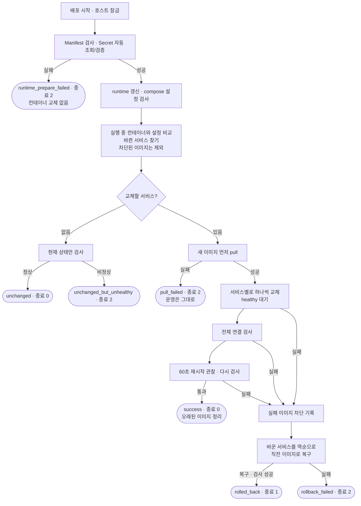

# 배포 검증 및 롤백 프로세스

## 개요

KeepGo V1은 EC2 한 대에서 Docker Compose로 네 개의 컨테이너를 운영한다.

| 서비스 | 정체 | 역할 |
| --- | --- | --- |
| web | Nginx | 외부 입구(80/443). TLS를 처리하고 `/api`는 backend로, 나머지는 frontend로 전달 |
| frontend | Next.js | 화면 렌더링. 외부에 직접 노출되지 않음 |
| backend | Spring Boot | API 서버. RDS(MySQL)와 ai-api를 사용 |
| ai-api | FastAPI | AI 기능 서버 |

앱 저장소(BE·FE·AI)의 CI가 이미지를 커밋 SHA 태그로 ECR에 올린다. 그러면 Cloud 저장소가 서비스별 목표 버전을 기록한 Manifest를 자동으로 갱신한다. 이어서 GitHub Actions가 AWS SSM으로 EC2의 배포 스크립트 `deploy.sh`를 실행한다. web과 frontend는 FE 저장소의 같은 커밋에서 만들어져 항상 같은 SHA로 배포되지만, 이미지와 컨테이너는 따로다.

이 문서는 **무엇을 배포 성공으로 보는지, 실패하면 어떻게 되돌리는지, 사람이 언제 개입하는지**를 정의한다.

### 핵심 원칙

1. **바뀐 서비스만, 하나씩 교체한다.** 바뀌지 않은 컨테이너는 건드리지 않는다.
2. **컨테이너가 떴다고 성공이 아니다.** healthy 상태, 컨테이너 간 연결, 60초 안정성 관찰을 모두 통과해야 성공이다.
3. **실패하면 자동으로 직전 이미지로 되돌리고, 같은 불량 이미지는 다시 배포하지 않는다.**
4. **자동 복구까지 실패하면 Discord로 사람을 부른다.** 자동 복구에 성공한 실패는 알리지 않고 실행 기록에만 남긴다.

## 전체 흐름



종료 코드 0과 1은 자동으로 정리된 결과다. **종료 코드 2는 사람이 확인해야 하는 결과**이고 Discord 알림이 간다.

## 1. 교체할 서비스 찾기

Docker Compose는 컨테이너를 만들 때 서비스 설정 전체(이미지 태그, 환경변수, 볼륨, healthcheck 등)의 해시를 컨테이너 라벨에 붙여 둔다. `deploy.sh`는 새 Manifest로 계산한 해시와 실행 중인 컨테이너의 해시를 비교해 **다른 서비스만** 교체 대상으로 삼는다.

- 이미지 버전이 바뀐 경우와 compose 설정이 바뀐 경우를 모두 잡는다.
- 실행 중인 컨테이너의 설정 해시가 기준이다. env·JWT 파일은 별도 적용 기록(`runtime-applied-backend.json`, `runtime-applied-ai-api.json`)의 컨테이너 ID·파일 지문과 비교한다. 최초 도입·기록 유실 시 해당 서비스를 한 번 재생성한다. JWT만 바뀌면 Backend, AI env만 바뀌면 AI를 강제 재생성한다.
- 이전에 검증에 실패해 차단된 이미지(7절)는 교체 대상에서 빠지고, 그 서비스는 기존 버전으로 계속 동작한다.
- 교체할 서비스가 없으면 아무것도 바꾸지 않고 현재 상태만 검사한다(4절 기준).
- 같은 EC2에서 배포가 동시에 돌지 않도록 파일 잠금(`flock`)을 건다. 이미 배포 중이면 즉시 종료 코드 2로 끝난다.

## 2. 교체 전 준비: 새 이미지를 먼저 받는다

배포 잠금 안에서 BE·AI Secret을 자동 조회하고 전체 기본 검증 후 env·JWT 파일을 갱신한다. 조회/검증 실패는 파일 변경 전에, 저장 실패는 컨테이너 교체 전에 `runtime_prepare_failed`(2)로 중단한다. Secret 조회는 교체 대상 계산 전에 실행되므로 FE만 변경해도 필요하다. 같은 내용의 파일은 다시 교체하지 않는다. 조회 오류 원문·비밀값·지문은 출력하지 않는다.

컨테이너를 멈추기 **전에** 교체 대상의 새 이미지를 모두 ECR에서 받는다. ECR 로그인이나 이미지 다운로드가 실패하면 컨테이너를 하나도 바꾸지 않고 끝낸다. 운영 서비스는 기존 버전 그대로 동작하고, 결과는 `pull_failed`(종료 코드 2)이며 Discord 알림이 간다.

pull 실패 시 호스트 runtime 파일은 이미 갱신돼 있을 수 있지만 적용 기록은 갱신하지 않는다. 다음 배포에서도 실제 컨테이너에 미적용된 파일 변경을 감지한다. 차단된 서비스를 건너뛰어도 적용 기록을 갱신하지 않는다. 교체 후 전체 검증 성공 또는 이미지 롤백 후 전체 검증 성공 때 기록한다.

되돌릴 때 쓸 직전 이미지는 지금 실행 중인 컨테이너가 쓰고 있어서 이미 EC2에 있다. 그래서 롤백은 다운로드에 의존하지 않는다.

## 3. 교체 순서와 이유

교체 순서는 **ai-api → backend → frontend → web**이다. 원칙은 **호출받는 쪽을 먼저 바꾸는 것**이다.

- backend는 ai-api를 호출하므로, ai-api를 먼저 새 버전으로 올린 뒤 backend를 바꾼다.
- web(Nginx)은 backend와 frontend로 요청을 넘긴다. 그래서 둘을 먼저 바꾸고 web을 마지막에 바꾼다. 새 Nginx 설정이 새 경로를 가리켜도 그 경로를 처리할 앱이 이미 떠 있게 된다.
- web은 외부 입구라 교체하는 동안 사이트 전체가 잠깐 끊긴다. 그래서 마지막에 한 번만 바꾼다.

각 서비스는 다른 서비스를 건드리지 않고(`--no-deps`) 하나씩 교체한다. 새 컨테이너가 healthy가 될 때까지 **최대 300초** 기다린다. 기다리는 동안 healthy가 되지 않으면 그 자리에서 실패로 판정한다. web을 교체하지 않은 배포라면, 새 backend·frontend 컨테이너 주소를 바로 반영하도록 Nginx에 설정 다시 읽기(reload)만 요청한다.

## 4. 성공 판정 기준

### 컨테이너 자체 검사 (healthcheck)

| 서비스 | 검사 | 통과 기준 |
| --- | --- | --- |
| web | 컨테이너 안에서 `/healthz` 요청 | 응답 성공 |
| frontend | 컨테이너 안에서 `/` 요청 | 응답 코드 500 미만 |
| backend | 컨테이너 안에서 `/actuator/health` 요청 | 응답에 `"status":"UP"` 포함. Spring 기본 health라 DB 연결 확인도 포함 |
| ai-api | 컨테이너 안에서 `/health` 요청 | 응답 성공 |

### 전체 연결 검사

교체한 서비스뿐 아니라 **네 서비스 전체**를 검사한다.

| 검사 | 확인하는 것 |
| --- | --- |
| 네 컨테이너 모두 healthy | 교체하지 않은 서비스까지 정상인지 |
| Nginx → Frontend | web 컨테이너에서 `http://frontend:3000/` 요청 성공 |
| Backend → AI, RDS | backend 컨테이너에서 ai-api:8000, RDS:3306으로 TCP 연결 성공 |
| EC2 → Nginx | EC2에서 `http://127.0.0.1/healthz` 요청 성공 |

### 안정성 관찰

전체 검사를 통과하면 교체한 컨테이너의 재시작 횟수를 기록하고 **60초** 기다린다. 그동안 재시작이 한 번이라도 있으면 실패로 본다. 예를 들어 기동 직후에는 괜찮다가 DB 커넥션 풀을 초기화하면서 죽는 경우를 잡는다. 60초 뒤 전체 연결 검사를 한 번 더 통과해야 최종 성공이다.

성공하면 교체한 서비스마다 **현재 이미지와 직전 이미지(다음 롤백용)만 남기고** 오래된 이미지를 지워 디스크가 차지 않게 한다.

## 5. 결과와 종료 코드

| 결과 | 종료 코드 | 운영 상태 | GitHub Actions | Discord |
| --- | --- | --- | --- | --- |
| `success` | 0 | 새 버전 | 성공 | 보내지 않음 |
| `unchanged` | 0 | 바뀐 것 없음, 정상 | 성공 | 보내지 않음 |
| `rolled_back` | 1 | 직전 버전으로 복구됨 | 실패로 표시 | 보내지 않음 (자동 처리됨) |
| `rollback_failed` | 2 | 일부 서비스가 비정상일 수 있음 | 실패 | **보냄** |
| `pull_failed`, `ecr_login_failed` | 2 | 바뀐 것 없음 | 실패 | **보냄** |
| `unchanged_but_unhealthy` | 2 | 바뀐 것은 없지만 현재 비정상 | 실패 | **보냄** |
| `invalid_manifest`, `invalid_compose` | 2 | 바뀐 것 없음 | 실패 | **보냄** |
| `runtime_prepare_failed` | 2 | 컨테이너 교체 없음. 저장 오류면 호스트 파일 일부는 바뀌었을 수 있음 | 실패 | **보냄** |
| `runtime_state_failed` | 2 | 발생 시점에 따라 교체 전 또는 교체/복구 완료 후 | 실패 | **보냄** |
| SSM 실패·시간 초과, 배포 시작 전 오류 | — | 알 수 없음 | 실패 | **보냄** |

`unchanged`는 "목표 버전이 모두 반영됨"과 같은 뜻이 아니다. 차단된 이미지를 건너뛴 결과일 수도 있다. 이 경우 해당 서비스는 이전 버전으로 계속 동작한다.

## 6. 자동 롤백

교체, 전체 연결 검사, 안정성 관찰 중 어느 단계에서든 실패하면 다음 순서로 되돌린다.

1. 실패 원인, 컨테이너 상태, 교체한 서비스의 최근 로그 60줄을 배포 로그에 남긴다.
2. 실패한 이미지를 차단 목록에 기록한다(7절).
3. 이번 배포에서 **교체를 시도한 서비스 전부**를 **역순**으로, 교체 직전 컨테이너가 쓰던 이미지 태그로 되돌린다. 교체 도중 실패한 서비스도 포함된다.
4. 되돌린 서비스마다 healthy를 기다린 뒤 전체 연결 검사를 다시 한다.
5. 모두 통과하면 `rolled_back`(종료 코드 1)으로 끝난다. 하나라도 실패하면 즉시 멈추고 `rollback_failed`(종료 코드 2)로 끝나며 Discord로 알린다.

예를 들어 FE 배포에서 frontend 교체는 성공하고 web(Nginx)이 실패하면, web → frontend 순서로 둘 다 이전 버전으로 돌린다.

### 롤백이 되돌리는 범위

| 되돌림 | 되돌리지 않음 |
| --- | --- |
| 교체한 서비스의 **이미지 버전** | compose 설정, 환경변수, Secret·JWT 파일 |
| | RDS의 스키마와 데이터 |

따라서 사람이 compose 설정을 바꾼 것이 원인이면 이미지를 되돌려도 해결되지 않는다. 이 경우 `rollback_failed`로 끝나고, 설정을 되돌리는 PR로 해결한다.

Secret도 매 배포 자동 갱신하지만 이미지 롤백 때는 최신 조회값을 유지한다. 잘못된 Secret이 원인이면 Secrets Manager의 값을 수정/복원하고 Deploy production을 다시 실행한다. 관련 절차는 [운영 절차 8절](v1-operations.md#8-secret-변경)을 따른다.

## 7. 실패 이미지 차단

같은 불량 이미지를 계속 다시 배포하면 그때마다 서비스가 잠깐씩 끊긴다. 이를 막으려고 실패한 이미지를 EC2의 `/opt/keepgo/state/failed-images`에 `서비스 SHA` 형식으로 한 줄씩 기록한다. 다음 배포부터 목록과 정확히 일치하는 이미지는 건너뛴다.

| 실패 유형 | 차단 대상 |
| --- | --- |
| 특정 서비스가 healthy가 되지 않거나 관찰 중 재시작 | 그 서비스의 새 이미지. 같은 커밋에서 나온 짝(web·frontend)도 함께 |
| 원인 서비스를 특정할 수 없는 전체 연결 실패 | 이번에 교체한 새 이미지 전부 |
| 이미지는 그대로이고 compose 설정만 바뀐 서비스의 실패 | 차단하지 않음. 정상 이미지까지 막으면 설정을 되돌려도 복구되지 않기 때문 |
| pull 실패, 설정 오류 등 교체 전 실패 | 차단하지 않음 |

**차단은 자동으로 풀린다.** 앱 저장소에 수정 커밋이 올라오면 SHA가 달라져 새 이미지로 취급되기 때문이다. RDS 점검처럼 일시적인 원인으로 차단된 경우에만 사람이 해당 줄을 지우고 다시 배포한다.

```sh
sudo sed -i '/^backend 15b54fed37df/d' /opt/keepgo/state/failed-images
```

## 8. 사람이 개입하는 경우

Discord 알림이 오면 메시지의 GitHub Actions 링크에서 배포 로그의 마지막 `결과:` 값을 먼저 본다.

| 결과 | 조치 |
| --- | --- |
| `pull_failed` | ECR에 해당 SHA 이미지가 있는지, EC2의 ECR 권한을 확인한다. 이미지가 없으면 앱 CI를 다시 실행하거나 새 커밋을 올린다. 해결 전까지는 **다른 서비스 배포도 pull 단계에서 함께 멈춘다** |
| `ecr_login_failed` | EC2 IAM 역할과 AWS 연결을 고친 뒤 수동 배포 |
| `runtime_prepare_failed` | BE·AI Secret 읽기 권한·필수 값·기본 형식, EC2 파일 권한·디스크를 확인한 뒤 수동 배포 |
| `runtime_state_failed` | 실제 컨테이너 상태 및 runtime 파일·적용 기록 권한/디스크 확인 후 수동 배포 |
| `invalid_manifest`, `invalid_compose` | 마지막으로 병합된 설정 PR을 revert한 뒤 수동 배포 |
| `rollback_failed` | 서비스가 새 버전·이전 버전·비정상 상태로 섞여 있을 수 있다. 아래 명령으로 실제 상태부터 확인하고 원인(설정, Secret, RDS)을 고친다 |
| `unchanged_but_unhealthy` | 배포와 무관하게 현재 스택이 비정상이다. 컨테이너와 RDS 상태를 조사한다 |
| SSM 실패·시간 초과 | EC2에서 배포가 아직 진행 중일 수 있다. `history.log`에 결과가 남았는지 확인한 뒤에 다시 실행한다 |
| 자동 릴리스에서 PR 병합 후 배포 호출 실패 | 다음 조회는 이미 반영된 것으로 보고 배포를 다시 부르지 않는다. Deploy production을 수동으로 실행한다 |

EC2에서 상태를 확인하는 명령:

```sh
cd /opt/keepgo/cloud
sudo tail -n 20 /opt/keepgo/state/history.log          # 최근 배포 결과
sudo docker compose -f compose.yaml ps                   # 컨테이너 상태
sudo docker compose -f compose.yaml logs --tail=100 backend
sudo cat /opt/keepgo/state/failed-images                # 차단된 이미지
```

원인을 고친 뒤에는 GitHub Actions의 **Deploy production**을 main에서 수동 실행하고 `success` 또는 `unchanged`를 확인한다.

## 9. 수동 롤백

healthcheck는 통과했지만 기능 버그가 있는 버전은 자동 롤백 대상이 아니다. 이때는 사람이 되돌린다.

**권장: 앱 저장소에서 revert 커밋을 올린다.** 새 SHA가 생기므로 평소처럼 10분 안에 자동 배포된다. 가장 빠르고 기록도 깔끔하다.

**급할 때: 이전 버전을 직접 지정한다.**

1. 자동 배포 스위치(`AUTO_DEPLOY_ENABLED`)를 `false`로 끈다. 켜 둔 채로 되돌리면 다음 조회가 다시 최신 버전으로 올린다.
2. 정상이었던 이전 SHA를 확인한다. PR 병합 기록만 믿지 말고 배포 이력(`history.log`, Actions 결과)으로 실제 정상 운영 버전을 확인한다.
3. Manifest의 해당 서비스 SHA를 이전 값으로 바꾸는 PR을 병합한다. FE는 web과 frontend를 함께 바꾼다.
4. Deploy production을 main에서 수동 실행한다. 스위치가 꺼져 있어도 수동 실행은 된다.
5. 실제 컨테이너 버전과 기능을 확인한다.
6. 앱 저장소에 수정 버전이 올라오면 Auto release를 `dry_run`으로 실행해 배포 대상을 확인한 뒤 스위치를 다시 켠다.

## 10. DB는 롤백되지 않는다

자동·수동 롤백은 모두 **애플리케이션 이미지**만 되돌린다. RDS의 스키마와 데이터는 그대로다.

| 상황 | 대응 |
| --- | --- |
| 새 버전의 기동·기능 문제이고 DB는 정상 | 이미지만 롤백한다. RDS는 건드리지 않는다 |
| 잘못된 데이터 변경·삭제, 이전 버전과 호환되지 않는 스키마 변경 | 쓰기 중단 여부와 복구 시점을 정하고, RDS 자동 백업의 특정 시점 복구(PITR)나 사전 스냅샷으로 복원한다. 복원하면 새 DB 인스턴스가 생기므로 연결 주소 전환과 복구 시점 이후 데이터 처리를 함께 결정한다 |

이 때문에 앱 팀은 **직전 버전과 호환되는 스키마 변경만** 배포하고, 위험한 DB 변경은 배포와 분리해 변경 전에 수동 스냅샷을 만든다. 운영 RDS의 자동 백업 보존 기간과 실제 복원 시험은 AWS 설정에서 따로 확인해야 하는 항목이다.

## 11. 검증 현황

로컬에서 가짜 `docker` 명령으로 `deploy.sh`의 분기를 확인했다. 실제 EC2 시험은 남아 있다.

| 시나리오 | 결과 |
| --- | --- |
| Backend 새 버전 정상 | Backend만 교체, `success` |
| Backend healthcheck 실패 | 직전 이미지로 복구, 차단 기록, `rolled_back` |
| 차단된 이미지 재배포 | 건너뛰고 `unchanged` |
| FE 배포 중 web 실패 | web → frontend 역순 복구, 둘 다 차단, `rolled_back` |
| 롤백 이미지도 실패 | `rollback_failed` |
| 이미지 pull 실패 | 아무것도 바꾸지 않음, `pull_failed` |
| 바뀐 것 없음 | `unchanged` |
| 설정만 바뀐 서비스 실패 | 차단하지 않음, `rollback_failed` |
| 원인 불명 연결 실패 | 교체한 이미지 모두 차단, 복구 시도 |

실제 환경에서 확인할 항목:

- 첫 수동 배포가 예상한 서비스만 교체하는지
- BE·FE·AI 새 이미지가 자동 배포되는지
- 일부러 실패하는 이미지가 자동 롤백되는지
- 없는 이미지 지정 시 `pull_failed`와 알림이 오는지

실패 시험은 팀과 합의한 점검 시간에 진행한다.

## 12. 한계와 감수한 이유

이 프로세스는 **EC2 한 대, 운영 인원 소수, 서비스 초기 단계**라는 조건에 맞춰 단순함을 우선했다. 아래 한계는 알고도 받아들인 것이다. 받아들인 이유와, 조건이 바뀌면 할 일을 함께 적는다.

### 1. 무중단 배포가 아니다

- **한계:** 교체하는 서비스는 새 컨테이너가 준비될 때까지 응답하지 않는다. Backend는 기동에 수십 초에서 최대 약 90초가 걸리고, 그동안 API가 502를 반환한다. web(Nginx)을 교체하면 사이트 전체가 몇 초 끊긴다.
- **감수한 이유:** 무중단으로 바꾸려면 같은 서비스를 두 벌 띄워 트래픽을 옮겨야 한다. 로드밸런서나 Nginx upstream 전환 로직이 필요하고, 두 벌을 띄울 메모리 여유도 확보해야 한다. EC2 한 대에서는 구조와 운영 부담이 크게 늘어난다. 지금은 트래픽이 적고 배포가 하루 몇 번 수준이라, 짧은 중단보다 단순하고 이해하기 쉬운 구조가 이득이라고 판단했다.
- **필요해지면:** 서비스를 여러 대로 나누는 단계(ECS 등)에서 로드밸런서 기반 롤링 배포로 전환한다.

### 2. healthcheck를 통과한 기능 버그는 잡지 못한다

- **한계:** 기동, 연결, 60초 안정성만 본다. 로그인이나 게시물 작성 같은 실제 기능이 깨져도 배포는 성공으로 끝난다.
- **감수한 이유:** 기능 검증(smoke 테스트)을 넣으려면 앱마다 시나리오, 테스트 계정, 테스트 데이터를 앱 팀과 합의해야 한다. 잘못 만든 검사는 정상 배포까지 막는다. 대신 앱 저장소에 revert 커밋을 올리면 10분 안에 자동 배포되는 빠른 복구 경로를 두었다.
- **필요해지면:** 앱 팀과 인증 없이 호출할 수 있는 핵심 기능 확인 API를 합의하고 전체 연결 검사 단계에 추가한다.

### 3. 롤백은 이미지만 되돌린다

- **한계:** compose 설정, 환경변수, Secret, DB 스키마·데이터는 되돌리지 않는다. 설정 변경이 원인이면 자동 롤백도 실패한다.
- **감수한 이유:** 설정은 PR로, Secret 원본은 Secrets Manager에서 관리하며 Secret의 EC2 반영은 배포마다 자동 수행한다. 이전 설정 전체를 스냅샷으로 보관·복원하려면 배포 상태 파일과 버전 관리 로직이 필요하고 외부 DB/API 자격 증명도 함께 고려해야 한다. DB를 자동으로 되돌리면 그 사이에 쌓인 사용자 데이터를 잃을 수 있어 별도 복구 영역으로 둔다.
- **필요해지면:** 설정 변경이 잦아지면 설정 변경 PR에도 배포 전 검증 단계를 추가한다. DB는 계속 사람이 판단하고, 스키마 변경은 이전 버전과 호환되게 한다는 원칙을 유지한다.

### 4. 배포 도중 끊기면 자동으로 이어서 복구하지 않는다

- **한계:** SSM 명령이 시간 초과되거나 EC2의 배포 프로세스가 중간에 죽으면, 일부 서비스만 교체된 상태로 남을 수 있다.
- **감수한 이유:** 이어서 복구하려면 "어디까지 진행했는지"를 파일에 기록하고 복구 모드를 따로 만들어야 한다. 이런 상태 관리 로직은 코드를 이해하기 어렵게 만들고, 중간 중단은 드물다. 대신 배포를 다시 실행하면 설정 해시를 다시 비교해 **아직 바뀌지 않은 서비스만** 처리하므로, 사람이 한 번 재실행하는 것으로 대부분 정리된다. 동시 실행은 파일 잠금으로 막는다.
- **필요해지면:** 중단이 반복되면 진행 기록과 자동 재개를 추가한다.

### 5. 이미지를 SHA 태그로만 식별한다

- **한계:** 이미지 내용 자체의 지문(digest)은 고정하지 않는다. 누군가 같은 SHA 태그로 다른 이미지를 덮어 올리면 검증되지 않은 이미지가 배포될 수 있다.
- **감수한 이유:** digest를 고정하려면 배포 목록에 필드를 추가하고, ECR을 조회할 IAM 역할을 새로 만들어야 한다. 앱 CI는 커밋마다 새 SHA 태그를 한 번만 올리는 구조라 덮어쓰기 위험이 낮다.
- **필요해지면:** ECR 저장소에 태그 덮어쓰기 금지(immutable tags)를 켠다. 코드 변경 없이 위험을 없앨 수 있는 가장 싼 보완이다.
